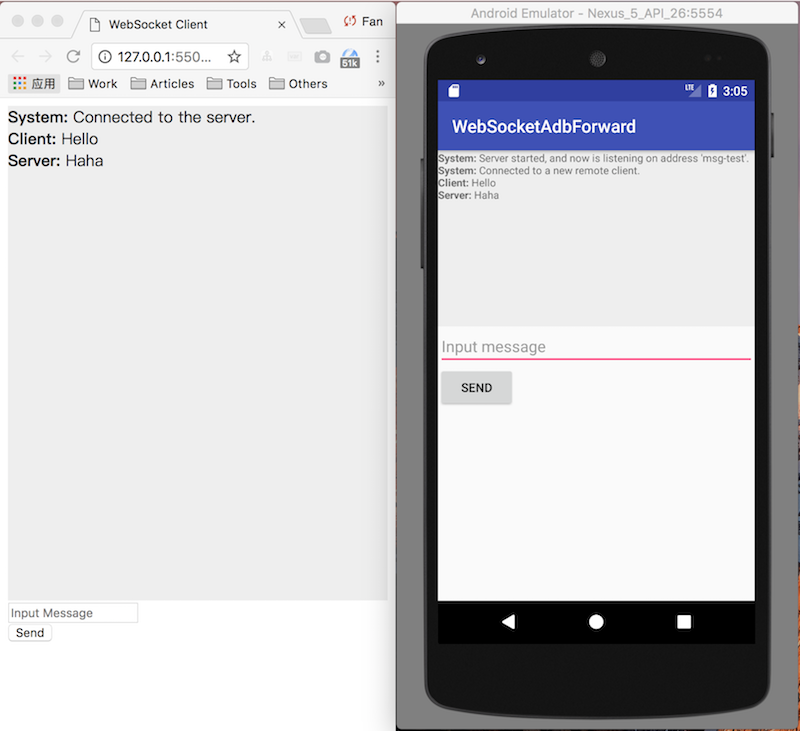

The well-known [stetho](https://github.com/facebook/stetho) library has implemented a tiny websocket server internally, for interacting with the chrome explorer on computer. In the same way, we can use it to interact with the client applications which are on computer.

This project demonstrates a simple messenger system between mobile and computer. It includes a [server app](example-server-app) runing on the mobile, a [py-client](example-py-client) and a [web-client](web-client) runing on the computer. You can see the code for more detail.

For forwarding messages through the websocket between computer and mobile, we need to use the `adb forward` command. See [here](example-py-client/client.py#L45).

